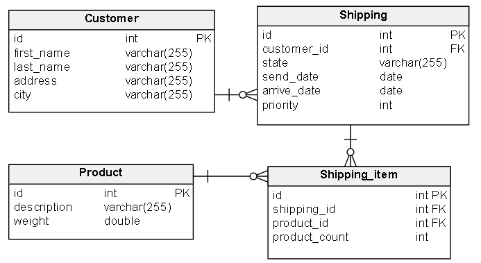
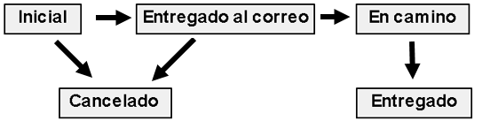

# Mareo Envíos 

Web Service para la gestión digital de envíos de mercadería a todo el país

---

## 🚀 Quick Start

Querés probarlo? Es muy simple:

```bash
# 1. Clonar y configurar
git clone <repo>
cd mareo-envios
cp .env.example .env

# 2. Levantar todo con Docker
docker-compose up --build

# 3. Listo! 🎉
```

### ¿Dónde encuentro todo?
- **API**: http://localhost:8080
- **Swagger UI**: http://localhost:8080/swagger-ui.html  
- **Métricas**: http://localhost:8080/actuator/prometheus
- **Health Check**: http://localhost:8080/actuator/health

---

## 🏗️ Arquitectura que propuse

Estructuré el proyecto con una **arquitectura en capas limpia**:

```
Controller → Service (Interface) → ServiceImpl → Repository → Database
```

### Organización de paquetes
```
sube.interviews.mareoenvios
├── config/              # Cache, Retry, OpenAPI config
├── controller/          # Endpoints REST
├── domain/              # Entidades JPA y enums
├── dto/                 # Request/Response objects
├── event/               # Sistema de eventos
├── exception/           # Manejo de errores
├── mapper/              # Entity ↔ DTO conversions
├── repository/          # Data access layer
├── service/             # Business logic
└── shipping/            # State management
```

---

## 🎯 Patrones de diseño que implementé

| Patrón | Dónde lo usé | Por qué lo elegí                                    |
|---|---|-----------------------------------------------------|
| **Strategy** | `shipping/state/` | Cada estado maneja su propia lógica. Fácil extender |
| **Factory** | `shipping/factory/` | Resuelve la estrategia correcta facilmente          |
| **Template Method** | `BaseService` | Evita repetición en CRUD operations                 |
| **Observer** | `event/` | Desacopla auditoría del business logic              |
| **Builder** | Entidades y DTOs | Construcción segura y legible de objetos            |

---

## 📊 Modelo de datos



### Flujo de estados de envío



| Estado | Siguiente estado posible |
|---|---|
| `INITIAL` | → `SENT_TO_MAIL`, → `CANCELLED` |
| `SENT_TO_MAIL` | → `IN_TRAVEL`, → `CANCELLED` |
| `IN_TRAVEL` | → `DELIVERED` |
| `DELIVERED` | (Estado final) |
| `CANCELLED` | (Estado final) |

---

## 🔌 Endpoints disponibles

### Customer

| Método | Path | Descripción |
|---|---|---|
| `GET` | `/customer/info/{customerId}` | Información de un comprador |
| `GET` | `/customer/info?page=0&size=20` | Listado paginado de compradores |

### Shipping

| Método | Path | Descripción |
|---|---|---|
| `GET` | `/shipping/info/{shippingId}` | Información de un envío con detalle de productos |
| `GET` | `/shipping/info/{sendDateFrom}/{sendDateTo}?page=0&size=20` | Envíos paginados por rango de fechas (formato `yyyy-MM-dd`) |
| `GET` | `/shipping/info/state/{state}?page=0&size=20` | Listado paginado de envíos por estado |
| `POST` | `/shipping/create` | Crear solicitud de envío |
| `PATCH` | `/shipping/transition/sendToMail/{shippingId}` | Transición → SENT_TO_MAIL |
| `PATCH` | `/shipping/transition/inTravel/{shippingId}` | Transición → IN_TRAVEL |
| `PATCH` | `/shipping/transition/delivered/{shippingId}` | Transición → DELIVERED |
| `PATCH` | `/shipping/transition/cancelled/{shippingId}` | Transición → CANCELLED |

### Reports

| Método | Path | Descripción |
|---|---|---|
| `GET` | `/reports/topSended` | Top 3 productos más solicitados |

---

## 💡 Decisiones técnicas importantes

### Cache con Redis
Implementé cache multi-nivel para optimizar performance:
- **Clientes**: 15 min TTL
- **Envíos**: 10 min TTL  
- **Consultas por estado/fecha**: 5 min TTL
- **Top productos**: 30 min TTL

### Sistema de reintentos
Las operaciones críticas tienen hasta **3 reintentos** con backoff exponencial:
- `createShipping` y `transitionState`
- Solo para fallos transitorios (DB, Redis)
- Excepciones de negocio no se reintentan

### Validaciones robustas
- **@ValidDateRange**: Validador custom para rangos de fechas
- **@Size constraints**: Protección contra ataques de strings largos
- **Validaciones de negocio**: Reglas de transición de estados

### Base de datos optimizada
- **Índices estratégicos** en columnas frecuentemente consultadas
- **JOIN FETCH** para evitar N+1 queries
- **Liquibase** para control de versiones del schema

---

## 🧪 Testing que incluí

### Cobertura
- **16 archivos de test** (13 unitarios + 3 de integración)
- **+80% cobertura** del código base
- Tests de **edge cases** y escenarios de error

### Ejecutar tests
```bash
# Todos los tests
mvn test

# Coverage report
mvn clean test jacoco:report
```

---

## 🛠️ Stack tecnológico

| Tecnología | Versión | Por qué la elegí |
|---|---|---|
| **Java** | 17 | Modern features, performance |
| **Spring Boot** | 3.3.5 | Ecosistema maduro, productividad |
| **PostgreSQL** | 16 | Robusto, escalable |
| **Redis** | 7 | Cache ultra-rápido |
| **Docker** | multi-stage | Build optimizado, portabilidad |
| **Liquibase** | - | Control de versiones de DB |

---

## 📈 Métricas y Monitoring

Configuré métricas Prometheus para monitoring:
- **JVM metrics**: Memory, GC, threads
- **HTTP metrics**: Requests, response times
- **Database metrics**: Hikari connection pool
- **System metrics**: CPU, disk

Disponibles en: `/actuator/prometheus`

---

## 📝 Notas de implementación

- **Paginación 0-based**: Sigue convención de Spring Data
- **Endpoint `/shipping/info/state/{state}`**: Resuelve ambigüedad con `/shipping/info/{id}`
- **Cache por perfil**: Tests usan SimpleCacheManager, producción usa Redis
- **Segregación de interfaces**: `ShippingService` (read) vs `ShippingWriteService` (write)

